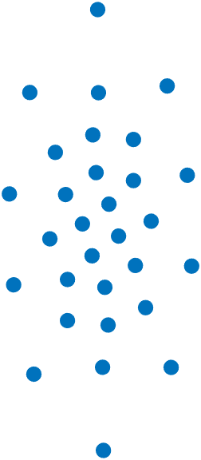

# GLCD-HQ
Gaussian sampling based on Localized Cumulative Distribution (LCD) and Cramér-von-Mises distance.
High quality (and slow) sampling procedure, does NOT use the simplification for standard normal distributions
(which is faster but gives inferior non-standard normally distributed samples).

## References
- Publication: Hanebeck, Huber, Klumpp, "Dirac Mixture Approximation of Multivariate Gaussian Densities", CDC 2009
- Code Repo: `svn checkout svn+ssh://i81server.iar.kit.edu/SVN/Publ/2009/DM_Gauss_Approx`

Theorem III.2 from paper and code differ; version from the code gives "nice" Gaussian samples.

## Code Author
- Matlab: Uwe Hanebeck (2009); modified by Daniel Frisch (2024-01)
- Julia: Daniel Frisch (2024-01)

## Possible Improvements
- Find appropriate parameters (bmin, bmax, reltol of quadrature and optimizer) with respect to dimension, #samples, and standard deviations
- Julia: implement analytic gradients (currently: ForwardDiff)

## Example
Two-dimensional Gaussian density with standard deviations 0.5 and 1, approximated with 30 samples:

